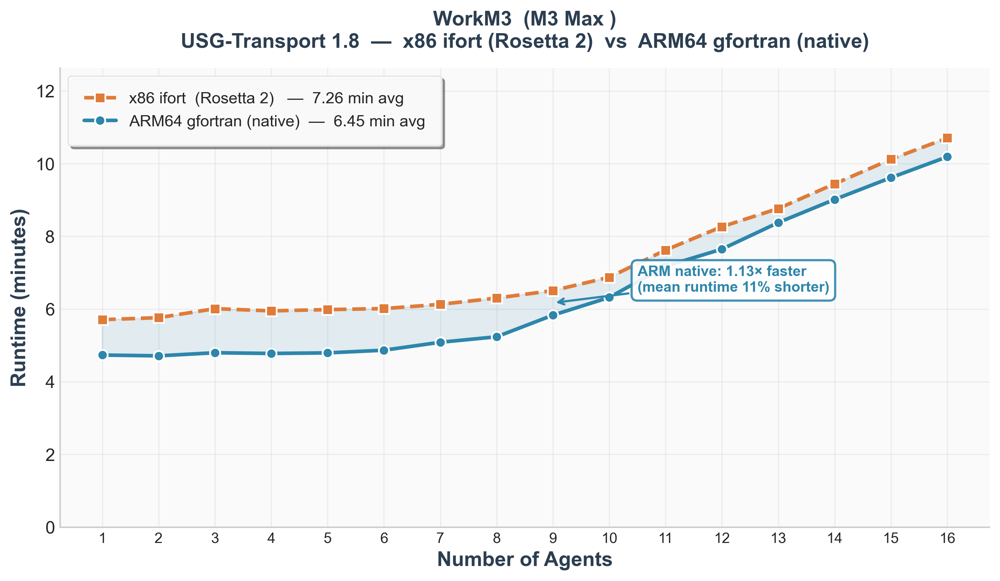
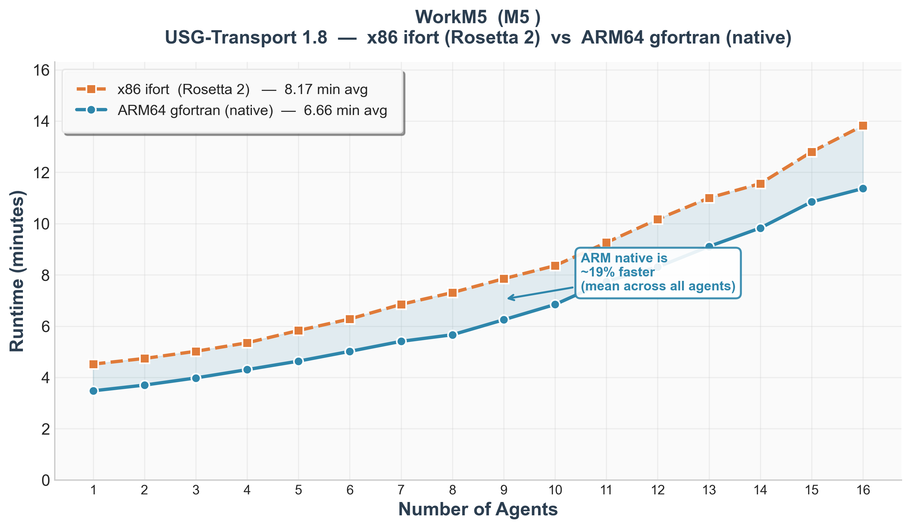
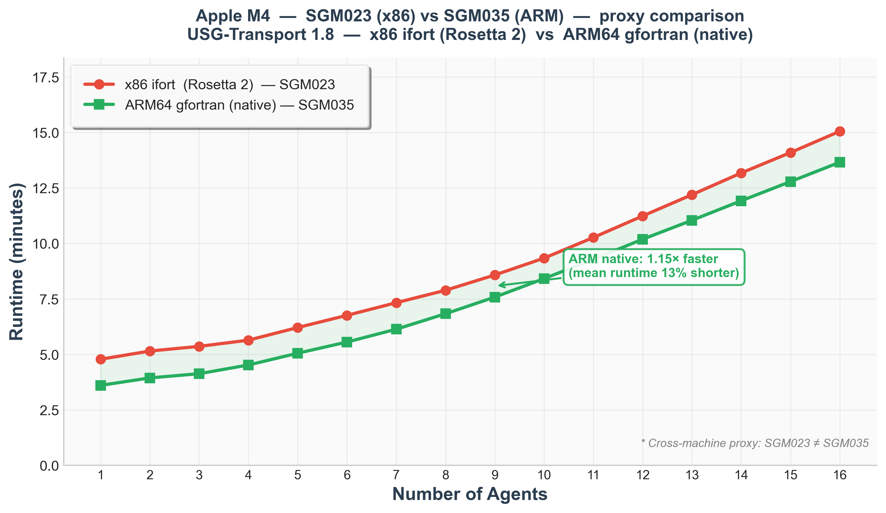
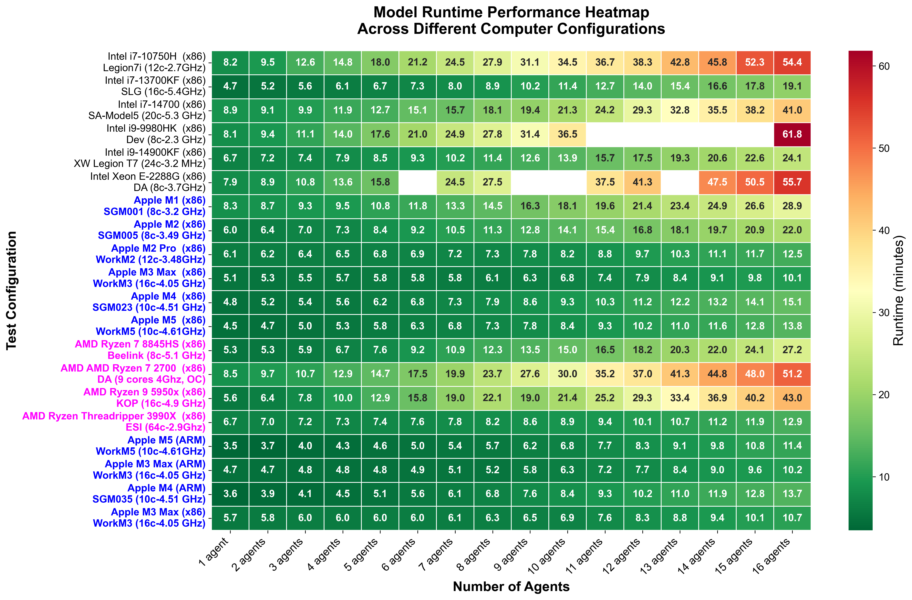
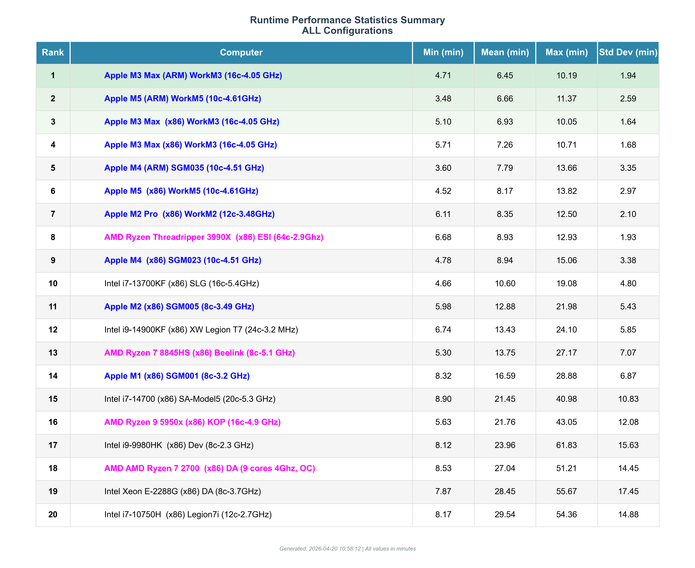

# Emerging Architectures: Groundwater Modeling Benchmark Suite

**A Performance Benchmark of Apple ARM Silicon vs. x86 Architectures for Groundwater Model Calibration**

## Overview
This repository contains the benchmarking suite, automation scripts, and results database for a community-maintained hardware performance comparison for groundwater modeling. It originated from the *Groundwater* journal Technology Spotlight article *"Emerging Architectures: A Performance Benchmark of Apple ARM Silicon for Groundwater Modeling"* ([doi:10.1111/gwat.70061](https://ngwa.onlinelibrary.wiley.com/doi/10.1111/gwat.70061)), and has since been expanded beyond the published results — most notably with the addition of a native ARM64 binary for USG-Transport 1.8 and the first direct x86-vs-ARM comparisons on the same hardware.

As groundwater modeling enters the "ensemble era" (PESTPP-IES, PEST_HP), computational bottlenecks have shifted from single-run times to the throughput of thousands of realizations. This project benchmarks consumer-grade ARM-based hardware (specifically Apple Silicon) against traditional x86 workstations to evaluate viability, cost-efficiency, and thermal stability for high-throughput PEST workflows.

## Repository Contents

* **`benchmark_model/`**: Contains the model files and necessary executables.
    * `MODFLOW_files/`: The Biscayne Bay MODFLOW-USG dataset (compressed as `files.7z`).
    * `executables/`: Pre-compiled USG-TRANSPORT 1.8 binaries and automation scripts for Mac and Windows.
* **`Runtimes/`**: Contains the master results spreadsheet (`ByscayneMode_Benchmarks.xlsx`).
* **`Scripts/`**: Python notebooks for post-processing and generating the plots/statistics found in the article.
* **`images/`**: Benchmark visualizations, updated as new results are added.

## Benchmarking Methodology
The protocol mimics the workload of a PEST parallel calibration agent using **USG-TRANSPORT 1.8**. The model is executed repeatedly, systematically increasing the number of simultaneous agents from 1 to 16 per machine.

* **Metric:** "Maximum Runtime"—the time required for the *slowest* realization in the batch to complete.
* **Constraint:** All agents simulate identical model realizations to maintain strictly controlled hardware throughput comparison.
* **macOS Executables:** Two binaries are now available for macOS:
  * `mfusg_gsi_1_8` — x86-64 compiled with ifort (Intel). **All results in the published paper and the original dataset used this binary.** Execution on Apple Silicon was performed through Rosetta 2 translation.
  * `usgt_180_arm` — native ARM64 compiled with GFortran on Apple Silicon. Requires Homebrew GCC (`brew install gcc`).

## Getting Started

### 1. Setup
1.  **Clone the repository:**
    ```bash
    git clone [https://github.com/roh-sgm/ARM_Benchmark_Public.git](https://github.com/roh-sgm/ARM_Benchmark_Public.git)
    cd ARM_Benchmark_Public
    ```
2.  **Extract Model Files:**
    Unzip `benchmark_model/MODFLOW_files/files.7z` into a working directory.

### 2. Choose Your OS Instructions

#### For Windows Users
The scripts are located in `benchmark_model/executables/Win/scripts`.
1.  **Automated workflow (recommended):**
    `run_benchmark_suite.ps1` is a PowerShell script that mirrors the macOS automated workflow. Run it from a PowerShell terminal:
    ```powershell
    # Allow local scripts (one-time, if not already set)
    Set-ExecutionPolicy -Scope CurrentUser RemoteSigned

    # Run full 1–16 agent sweep
    .\run_benchmark_suite.ps1 USGs_1.exe

    # Run a single batch (e.g., 8 agents only)
    .\run_benchmark_suite.ps1 USGs_1.exe 8

    # Run a range (e.g., agents 10 through 16)
    .\run_benchmark_suite.ps1 USGs_1.exe 10 16
    ```
    Requires Python 3 on PATH (`retrieve_runtimes.py` is included in the same folder).

2.  **Manual workflow:** The legacy batch scripts are provided as `.txt` files to avoid antivirus deletion.
    * Rename: `copy_files.txt` → `copy_files.bat`, `open_and_run.txt` → `open_and_run.bat`, `clean_up.txt` → `clean_up.bat`
    * Run `copy_files.bat` → `open_and_run.bat` → `clean_up.bat` in sequence.

#### For macOS Users
The scripts are located in `benchmark_model/executables/Mac/scripts` and are provided as `.sh` files.
1.  **Grant execution permissions:**
    ```bash
    chmod +x *.sh
    ```
2.  **Execution (manual workflow):**
    * Run `./copy_files.sh` to generate agent folders.
    * Run `./open_and_run.sh` to launch the simulations.
    * Run `./clean_up.sh` to delete folders after testing.
3.  **Automated workflow (recommended):**
    `run_benchmark_suite.sh` automates the full sweep in a single command. Pass the executable name as the first argument — the script looks for it in the `Mac/` directory, then falls back to your system `PATH`.
    ```bash
    # Run full 1–16 agent sweep
    ./run_benchmark_suite.sh usgt_180_arm          # ARM native binary
    ./run_benchmark_suite.sh mfusg_gsi_1_8         # x86 binary (Rosetta 2)

    # Run a single batch (e.g., 8 agents only)
    ./run_benchmark_suite.sh usgt_180_arm 8

    # Run a range (e.g., agents 10 through 16)
    ./run_benchmark_suite.sh usgt_180_arm 10 16
    ```
    Results are saved to `{ComputerName}_{datetime}_benchmark_results.csv` in the scripts folder. `retrieve_runtimes.py` (in the same folder) is required and handles runtime parsing automatically.

### 3. Submitting Your Results

Run the automated script — it produces a self-contained CSV named after your machine and the run timestamp (e.g. `WorkM5_2026-04-07_210000_benchmark_results.csv`). Then open a **GitHub Issue** and attach the CSV, or include it in a **Pull Request** by placing it in the `Runtimes/submissions/` folder.

Please include the following metadata in your issue or PR description:

| Field | Example |
|---|---|
| Computer name | WorkM5 |
| CPU model | Apple M5 |
| CPU cores / speed | 10c — 4.61 GHz |
| OS | macOS 15.3 |
| CPU architecture | ARM |
| Executable used | `usgt_180_arm` (ARM64 gfortran) |
| Manufacturer | Apple |
| Computer type | MacBook Pro Laptop |

> The maintainer will integrate submitted CSVs into `ByscayneMode_Benchmarks.xlsx` and regenerate the plots. You do not need to edit the spreadsheet directly.

## New Finding: ARM-Native Binary Delivers a 1.23× Speedup on Apple Silicon

> **All results in the published paper used the x86 ifort binary running under Rosetta 2 — even on Apple Silicon machines.**
> Now that a native ARM64 binary is available, direct comparisons are possible.

Initial benchmarks on an **Apple M5 MacBook Pro** show that the native ARM64 binary runs **1.23× faster** than the x86 binary under Rosetta 2 on average — meaning runtimes are **~19% shorter** across all agent counts:

| Metric | x86 ifort (Rosetta 2) | ARM64 gfortran (native) | Speedup |
|---|---|---|---|
| Mean runtime (1–16 agents) | 8.17 min | 6.66 min | **1.23× (−19%)** |
| Single-agent runtime | 4.52 min | 3.48 min | **1.30× (−23%)** |
| 16-agent runtime | 13.82 min | 11.37 min | **1.22× (−18%)** |

> **Note on metrics:** the speedup factor (1.23×) is the ratio of x86 to ARM runtime. The percentage in parentheses (−19%) is the runtime reduction `(x86 − ARM) / x86`. Both describe the same result; the plot below uses the runtime reduction.

This finding adds a new dimension to the benchmark: **the strong Apple Silicon results reported in the paper were achieved despite a Rosetta 2 translation overhead.** Native ARM execution pushes M-series performance even further ahead. Re-benchmarking all Mac machines with the ARM64 binary is ongoing.

A new **1-to-1 comparison plot** is available in `Scripts/Post-Proc/Runtime_Plots_1.ipynb` (`plot_exe_comparison` function) to visualise x86 vs ARM native runtimes for any machine with paired results.

### Methodology note: manual vs automated runs

The original paper benchmarks (Tests 1–16) were collected using manual workflows — each agent batch was triggered individually, with variable idle time between batches. This means the chip starts each batch from a relatively cool thermal state.

The `run_benchmark_suite.sh` / `run_benchmark_suite.ps1` automated scripts, introduced after the paper, run all batches (1→16 agents) sequentially with no pause between them. By the mid-to-high agent counts the chip has been under sustained load for an extended period, producing a more realistic picture of a real PEST parallel calibration run — but a different thermal starting condition than the manual approach.

**For rigorous x86 vs ARM paired comparisons, both binaries should be run with the automated script on the same machine in the same session.** Where the x86 result comes from a manual run and the ARM result from the automated script (or vice versa), the comparison reflects a mix of hardware and methodology differences and should be interpreted with caution.

Original paper results are kept in the dataset exactly as published — they will not be edited. New automated re-runs on the same machines are added as separate test entries, so both the published record and the updated methodology coexist in the repository.


*(Apple M3 Max WorkM3 — USG-Transport 1.8: x86 ifort via Rosetta 2 (Test20, automated) vs ARM64 gfortran native (Test18, automated). Both runs used `run_benchmark_suite.sh` in the same session — this is a properly paired comparison. The original manual x86 result from the paper (Test10) is preserved in the dataset for reproducibility.)*


*(Apple M5 WorkM5 — USG-Transport 1.8: x86 ifort via Rosetta 2 vs ARM64 gfortran native. Both runs used the automated script in the same session — this is a properly paired comparison.)*


*(Apple M4 — cross-machine proxy: SGM023 x86 ifort via Rosetta 2 vs SGM035 ARM64 gfortran native. Both are M4 Mac Mini units but different machines; a same-machine paired run is not yet available.)*

## Key Findings & Visualization
The benchmark results reveal a significant efficiency paradox between consumer ARM chips and high-end x86 workstations.

> **Note:** all results in the published article used the x86 ifort binary (via Rosetta 2 on Apple Silicon). The figures below reflect the current state of the dataset, which now includes Test17 — the first M5 benchmark run with the native ARM64 binary.

### Runtime Heatmap
Runtime performance (in minutes) across all hardware configurations. Green = faster; red = slower. Note how the "thermal throttling" degradation slope appears much earlier on x86 chips than on Apple Silicon.



### Runtime Statistics
Statistical breakdown (min, mean, max, std dev) for all tested configurations, ranked by mean runtime.



### Summary
* **Thermal Stability:** ARM-based chips maintained nearly flat runtime slopes under load, whereas x86 chips often exhibited steep linear degradation due to thermal throttling.
* **Cost Efficiency:** A consumer-grade **M4 Mac Mini** (\~$600) achieved parity with a 64-core **AMD Threadripper 3990X** (\~$4,000+) in parallel throughput tests (avg runtimes: 8.94 min vs 8.93 min).
* **Native ARM binary:** switching from x86 ifort (Rosetta 2) to the native ARM64 gfortran binary on the M5 delivers a further **1.23× speedup** (mean runtime 19% shorter). See the new finding section above.

## Contributing
We encourage the community to contribute their own results to expand this industry database. Run the automated benchmark script for your platform, then submit the output CSV via a **GitHub Issue** or **Pull Request** (see *Submitting Your Results* above). You do not need to edit the master spreadsheet — the maintainer handles integration.

## References
* Apple Inc. (2020). Apple unleashes M1. Apple Newsroom. [https://www.apple.com/newsroom/2020/11/apple-unleashes-m1/](https://www.apple.com/newsroom/2020/11/apple-unleashes-m1/) (last accessed on Dec 18th 2025).
* Doherty, J., 2024, PEST_HP Pest for Highly Parallelized Computing Environments. Watermark Numerical Computing, March 2024. PEST_HP version 18. [https://pesthomepage.org](https://pesthomepage.org) (last accessed on Dec 18th 2025).
* Panday, Sorab, Langevin, C.D., Niswonger, R.G., Ibaraki, Motomu, and Hughes, J.D., 2013, MODFLOW-USG version 1: An unstructured grid version of MODFLOW for simulating groundwater flow and tightly coupled processes using a control volume finite-difference formulation: U.S. Geological Survey Techniques and Methods, book 6, chap. A45, 66 p., [https://doi.org/10.3133/tm6A45](https://doi.org/10.3133/tm6A45)
* Panday, S. (2025). USG-Transport 2.6.0: Transport and other enhancements to MODFLOW-USG. [https://www.gsienv.com/software/modflow-usg/modflow-usg/](https://www.gsienv.com/software/modflow-usg/modflow-usg/) (last accessed on Dec 18th 2025).
* USGS (2025a). pymake. Python package for building MODFLOW-based programs from source files. [https://github.com/modflowpy/pymake](https://github.com/modflowpy/pymake) (last accessed on Dec 18th 2025).
* USGS (2025b). MODFLOW executables GitHub Repo. [https://github.com/MODFLOW-ORG/executables](https://github.com/MODFLOW-ORG/executables) (last accessed on Dec 18th 2025).
* White, J.T., Hunt, R.J., Fienen, M.N., and Doherty, J.E., 2020, Approaches to Highly Parameterized Inversion: PEST++ Version 5, a Software Suite for Parameter Estimation, Uncertainty Analysis, Management Optimization and Sensitivity Analysis: U.S. Geological Survey Techniques and Methods 7C26, 52 p., [https://doi.org/10.3133/tm7C26](https://doi.org/10.3133/tm7C26) (last accessed on Dec 18th 2025).

